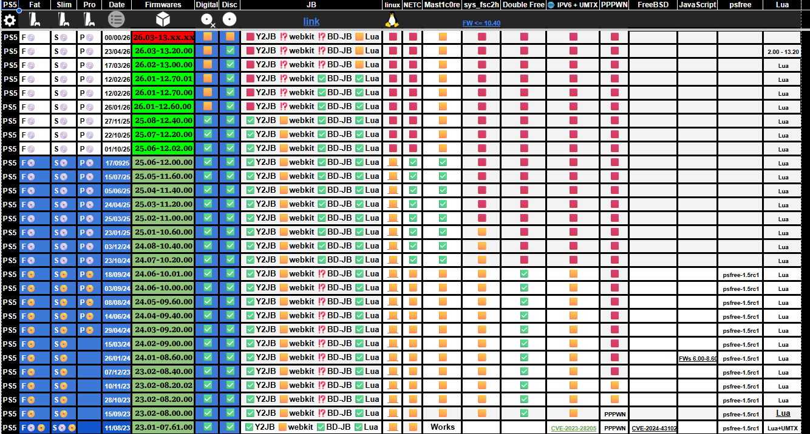
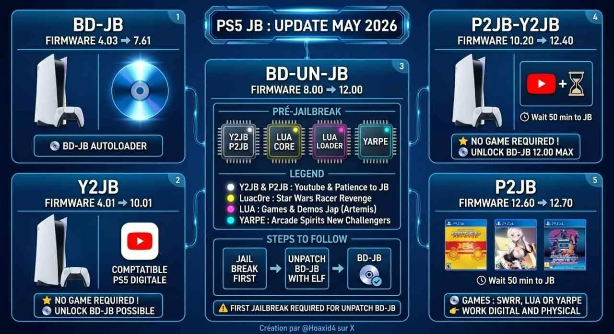

# PS5 Jailbreak Status & Exploit Usage Guide

## 📊 Jailbreak Status

Below is the current visual breakdown of firmware compatibility, WebKit/BD-J entry points, and kernel exploit availability. Always check your firmware version in `Settings > System > System Software` before attempting any exploit.

> **Important Note:** If your firmware is above the current exploitable threshold, disable automatic updates immediately under `Settings > System > System Software > System Software Update and Settings`.

---

## 🚀 Exploit Usage & Deployment

To deploy the host environment locally or access self-hosted exploit menus, follow the network topology and memory injection structure detailed below.

---

## 📬 Repository Feeds & Tracking
To stay up to date with the latest tool releases, payload updates, and homebrew releases, you can import our curated repository tracking feeds into your preferred RSS reader. 

*See the included OPML configuration files within this repository to import all tracking nodes at once.*
